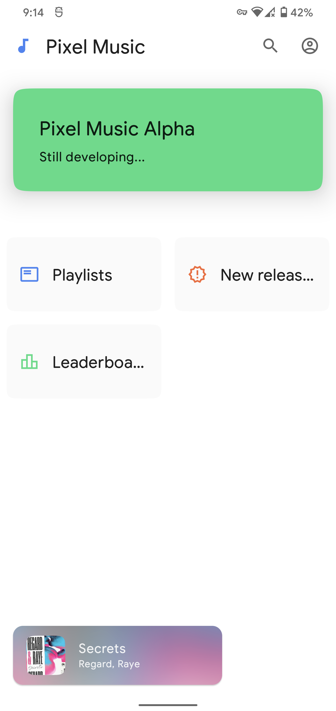
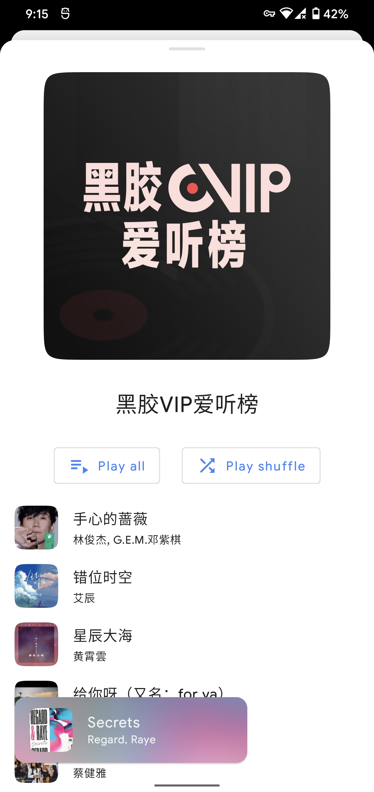

# Pixel Music

This is a beautiful **unofficial NetEase Cloud music player** for Android 🥳!

**Notice:**

* This project is still **in progress**.

## Where to get test apk

* [**Telegram Channel**](https://t.me/pixel_music_app)
* **QQ Group**: 1026441579

## Screenshots

### 0.1.0-alpha03: 2021, Feb 10

## Major plans

- [ ] Support log in

## Technical features

* **Kotlin** 1.4.30
* **Androidx** snapshot 7141556
* **Jetpack Compose** snapshot (1.0.0-alpha13)
* **ExoPlayer** 2.12.3

## Build requirements

* **Android Studio** Arctic Fox | 2020.3.1 Canary 6 or higher, or **IDEA**
* **Gradle** 7.0-milestone-1 or higher

## Special Thanks

* **Google Sans Rounded
  Font:** [google_sans_plus_font](https://github.com/nongthaihoang/google_sans_plus_font)
* **Amplitude Visualization:** [Amplituda](https://github.com/lincollincol/Amplituda)
* **Image Blur:** [android-stackblur](https://github.com/kikoso/android-stackblur)